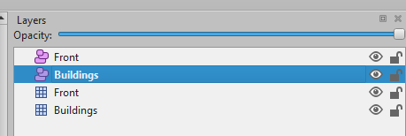
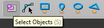
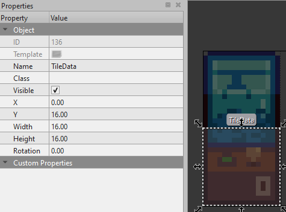
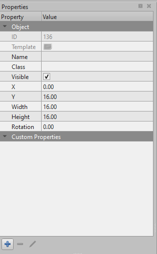
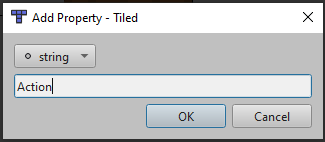
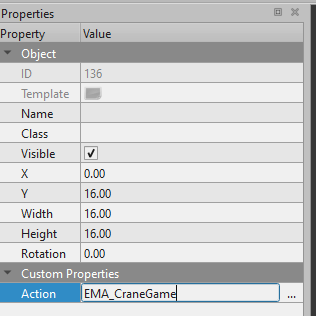
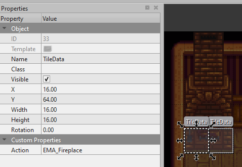
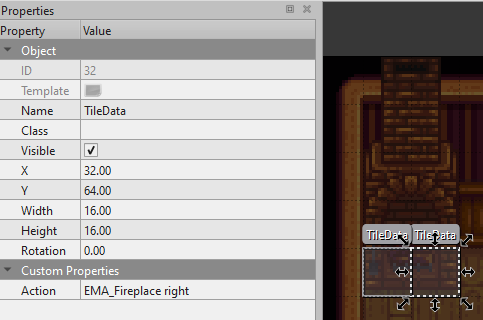
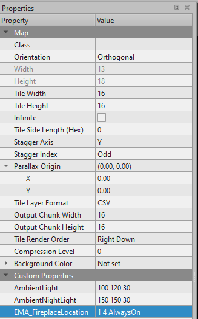
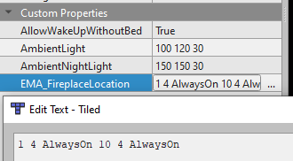

# Extra Map Actions

## Contents

* [Introduction](#introduction)
* [Examples](#examples)
  * [Content Patcher](#cp)
  * [Tiled](#tiled)
* [Extras](#extras)
  * [Crane Game Prizes](#craneprizes)
  * [Fireplaces](#fireplaces)

## Introduction<span id="introduction"></span>
Extra Map Actions adds new tile actions and map properties.<br>
| Tile Action | Description |
| :--- | :--- |
| EMA_CraneGame | Opens the crane game dialogue |
| EMA_LostAndFound | Opens [lost and found](https://stardewvalleywiki.com/Mayor%27s_Manor#Lost_and_Found) |
| EMA_OfflineFarmhandInventory | Opens dialogue window to choose an offline farmhand inventory to open |
| EMA_Fireplace \[right] | Can be used to create an operable fireplace |
| EMA_DivorceBook | Opens [divorce book](https://stardewvalleywiki.com/Mayor%27s_Manor#Divorce) |
| EMA_LedgerBook | Opens [ledger book](https://stardewvalleywiki.com/Multiplayer#Money) |
<br>

| Map Property | Description |
| :--- | :--- |
| EMA_FireplaceLocation \[\<intX> \<intY> \<FireplaceCondition>] + | Conditionally starts or stops a fireplace.<br>Combine with `EMA_Fireplace` tile action to make it further operable. |

The config contains two settings, `Debug Logging` and `Crane Game Cost`. Debug Logging will post logs to the console window as you interact with tiles that have the appropriate TileData, it's not that useful.<br>
Crane Game Cost must be a positive value or zero.<br>
If zero the prompt will change to reflect that it's free, otherwise if the player has enough money they'll be charged the cost when they select Yes to start playing.

## Examples<span id="examples"></span>
First, if you're not familiar with Content Patcher's `EditMap` then I suggest [checking out the docs](https://github.com/Pathoschild/StardewMods/blob/develop/ContentPatcher/docs/author-guide/action-editmap.md) for more detailed info about how it works.

### Content Patcher<span id="cp"></span>
For my example, I added a few test objects to the bus stop.<br>


With those in place, I used CP to add my custom properties to the bus stop map.
```json
{
  "Action": "EditMap",
  "Target": "Maps/BusStop",
  "MapTiles": [
    {
      "Position": {
        "X": 19,
        "Y": 22
      },
      "Layer": "Buildings",
      "SetProperties": {
        "Action": "EMA_LostAndFound"
      }
    },
    {
      "Position": {
        "X": 17,
        "Y": 22
      },
      "Layer": "Buildings",
      "SetProperties": {
        "Action": "EMA_OfflineFarmhandInventory"
      }
    }
  ]
}
```
The property value is case-sensitive.

### Tiled<span id="tiled"></span>
In order to add the property to your map in Tiled, select the Buildings object layer<br>



Select the Insert Rectangle tool<br>


Use the Insert Rectangle tool to drag a rectangle onto the tile you want the action to be on, which will create this dotted rectangle and the properties panel will show the data for that object<br>

<br>
Note: something must be on the tile layer, even if it's an invisible tile


If you need to select the object for any reason, select the Select Objects tool<br>



Name the object TileData<br>



At the bottom of the properties window, click the + button<br>



A new window will pop up, here we'll put `Action` and click OK<br>



Now in our properties window, we'll put the action we're trying to invoke<br>



Note: the action value is case-insensitive.
## Extras<span id="extras"></span>
### Crane Game Prizes<span id="craneprizes"></span>
Crane game prizes are mostly hardcoded, however you can use `Data/Movies` to add to or completely overwrite the prize lists.<br>
More detailed information can be found on the [migration page of the wiki](https://stardewvalleywiki.com/Modding:Migrate_to_Stardew_Valley_1.6#Custom_movies), but I have some examples and notes I will make here.<br><br>

#### Example 1
The first example is for completely overwriting the prize lists so that only your chosen prizes are available:
```json
{
  "Action": "EditData",
  "Target": "Data/Movies",
  "TargetField": [
    "spring_movie_0"
  ],
  "Entries": {
    "CranePrizes": [
      {
        "Rarity": 1,
        "Id": "CommonGroupDiamond",
        "ItemId": "(O)72"
      },
      {
        "Rarity": 2,
        "Id": "RareGroupDiamond",
        "ItemId": "(O)72"
      },
      {
        "Rarity": 3,
        "Id": "DeluxeGroupDiamond",
        "ItemId": "(O)72"
      }
    ],
    "ClearDefaultCranePrizeGroups": [
      1,
      2,
      3
    ]
  },
  "When": {
    "LocationName": "BusStop"
  },
  "Update": "OnLocationChange"
}
```
Notes:<br>
An empty prize group will cause errors, so if you use `ClearDefaultCranePrizeGroup` you have to add at least one entry to `CranePrizes` for every group you clear. In my example, since I'm clearing all three groups, I add the diamond to each group to avoid errors.

The `When` and `Update` fields are included to make the changes only happen when you enter the map with your crane game, this way you don't make changes to the default crane game at the theater. I use `BusStop` in my example because that's where my crane game is, but you would use the location name of wherever your crane game is.

These prize lists are specific to what movie should be playing, even if you haven't unlocked the theater yet, so in order to have prize lists that are the same you have to make changes to the `CranePrizes` for every movie, alternatively this means you can easily have seasonal and alternating yearly different prize lists.<br><br>

#### Example 2
The next example is for if you only want to add prizes without modifying the existing lists:
```json
{
  "Action": "EditData",
  "Target": "Data/Movies",
  "TargetField": [
    "spring_movie_0",
    "CranePrizes"
  ],
  "Entries": {
    "-1": {
      "Rarity": 1,
      "Id": "CommonDiamond",
      "ItemId": "(O)72"
    },
    "-2": {
      "Rarity": 2,
      "Id": "RareDiamond",
      "ItemId": "(O)72"
    },
    "-3": {
      "Rarity": 3,
      "Id": "DeluxeDiamond",
      "ItemId": "(O)72"
    }
  },
  "When": {
    "LocationName": "BusStop"
  },
  "Update": "OnLocationChange"
}
```
Notes:<br>
This time, in order to avoid overwriting the movie specific prizes, we use `TargetField` to target `CranePrizes` and negative indexed entries in order to only add new entries without risking editing existing entries.

The `When` and `Update` fields are included to make the changes only happen when you enter the map with your crane game, this way you don't make changes to the default crane game at the theater. I use `BusStop` in my example because that's where my crane game is, but you would use the location name of wherever your crane game is.<br><br>

#### Example 3
Because we're targeting `CranePrizes` like this, we can't also edit `ClearDefaultCranePrizeGroups` in one patch, so if we want to any of the default prize groups, we have to make a separate patch:
```json
{
  "Action": "EditData",
  "Target": "Data/Movies",
  "TargetField": [
    "spring_movie_0",
    "ClearDefaultCranePrizeGroups"
  ],
  "Entries": {
    "1": "1",
    "2": "2",
    "3": "3"
  },
  "When": {
    "LocationName": "BusStop"
  },
  "Update": "OnLocationChange"
}
```
Notes:<br>
This is obviously optional if you don't want to clear default prize groups and the same rules as earlier apply if you do, any groups you clear have to have an entry in the previous patch to add a new entry, empty groups will cause errors.

The `When` and `Update` fields are included to make the changes only happen when you enter the map with your crane game, this way you don't make changes to the default crane game at the theater. I use `BusStop` in my example because that's where my crane game is, but you would use the location name of wherever your crane game is.<br><br>

### Fireplaces<span id="fireplaces"></span>
Fireplace tile actions can be added directly to Tiled:<br>
<br>



Or they can be added through CP:<br>
```jsonc
{
  "Action": "EditMap",
  "Target": "Maps/<TargetMapGoesHere>",
  "MapTiles": [
    {
      "Position": {// tile position of the left tile of the fireplace
        "X": 0,
        "Y": 4
      },
      "Layer": "Buildings",
      "SetProperties": {
        "Action": "EMA_Fireplace"
      }
    },
    {
      "Position": {// tile position of the right tile of the fireplace
        "X": 1,
        "Y": 4
      },
      "Layer": "Buildings",
      "SetProperties": {
        "Action": "EMA_Fireplace right"
      }
    }
  ]
}
```
<br>

#### Fireplace Location Map Property
Additionally, this mod introduces a new map property `EMA_FireplaceLocation` that combines with a new CP dictionary asset<br>
`rokugin.EMA/FireplaceConditions`.<br>

The format of Fireplace Location is `EMA_FireplaceLocation [<intX> <intY> <fireplaceConditionsKey>] +` (the + indicates that you can create multiple entries following the same format, separated by a space).

The map property can be set in Tiled:<br>
<br>




Or with CP:<br>
```jsonc
{
  "Action": "EditMap",
  "Target": "Maps/<TargetMapGoesHere>",
  "MapProperties": {
    "EMA_FireplaceLocation": "1 4 AlwaysOn 10 4 AlwaysOn"
  }
}
```

<br>

#### Fireplace Conditions Data Asset
```jsonc
{
  "Action": "EditData",
  "Target": "rokugin.EMA/FireplaceConditions",
  "Entries": {
    "rokugin_custom1": {
      "Condition": "ANY \"SEASON fall winter\" \"WEATHER Here Rain Snow Storm GreenRain\""
    }
  }
}
```
